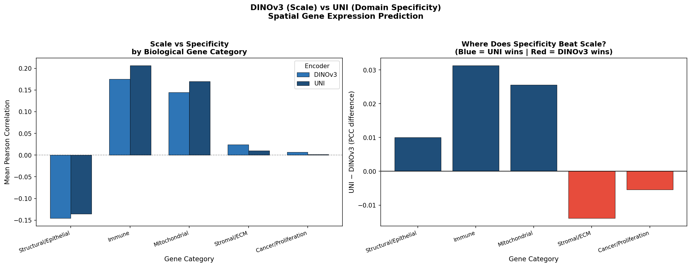

# Scale vs. Specificity: Predicting Spatial Gene Expression from H&E Histology Patches

> **Does pretraining scale beat domain specificity for spatial transcriptomics?**  
> A controlled comparison of DINOv3 (1.689B general images) vs UNI (100M pathology images).

---

## Overview

Spatial transcriptomics links tissue morphology to gene expression but costs $1,000-$3,000 per sample. This project asks: can a frozen Vision Transformer encoder predict gene expression directly from a standard H&E histology patch, without any sequencing?

We compare two pretrained ViT encoders on the **10x Visium Human Breast Cancer** dataset:

| Encoder | Pretraining | Data Scale | Mean PCC |
|---|---|---|---|
| DINOv3 | General (Meta) | 1.689B images | 0.077 |
| **UNI** | **Pathology-specific** | **100M histology images** | **0.091** |

UNI wins on **33/50 genes** (+18% overall). Domain specificity beats scale when cell-type recognition matters.

---

## Key Finding

UNI's advantage concentrates on biologically complex gene categories:
- **Immune genes**: UNI +0.031 PCC (plasma B cell morphology recognition)
- **Mitochondrial genes**: UNI +0.026 PCC (metabolic activity patterns)
- **Stromal/ECM**: DINOv3 +0.014 PCC (coarse tissue architecture)
- **Structural/Epithelial**: Both encoders fail — a resolution limitation, not a model failure

---

## Repository Structure

    spatial-gene-expression-cv/
    notebooks/
        Spatial_v3_ScaleVsSpecificity.ipynb
        top50_genes.json
    results/
        figures/
        pearson_results_v3.csv
        category_results_v3.csv
    README.md

> Large data files (.pt, .h5ad) are stored on Google Drive and not tracked in this repo.

---

## Methods

**Dataset:** 10x Visium Human Breast Cancer Section 1 — 3,798 spots x 36,601 genes

**Pipeline:**
1. Normalize expression (scanpy) + log1p transform
2. Select top 50 spatially variable genes via Moran's I (squidpy)
3. Extract 224x224 px H&E patches per spot
4. Freeze encoder -> extract embeddings -> train identical MLP head
5. Evaluate via per-gene Pearson Correlation on held-out test set (15%)

**Why frozen encoders?** Freezing both encoders and using identical MLP heads isolates representational quality as the sole experimental variable.

---

## Results

### Per-Gene Top 10 (by UNI PCC)

| Gene | DINOv3 | UNI | Winner | Biological Role |
|---|---|---|---|---|
| MALAT1 | 0.426 | 0.397 | DINOv3 | Long non-coding RNA, tumor cellularity |
| MGP | 0.367 | 0.354 | DINOv3 | Stromal fibroblast marker |
| TFF3 | 0.326 | 0.344 | UNI | Luminal epithelial / mucin-secreting cells |
| IGHG1 | 0.217 | 0.292 | UNI | Immunoglobulin heavy chain, plasma B cells |
| IGHG4 | 0.237 | 0.287 | UNI | Immunoglobulin heavy chain, plasma B cells |
| IGLC2 | 0.212 | 0.272 | UNI | Immunoglobulin light chain |

### Gene Category Summary

| Category | DINOv3 | UNI | Delta |
|---|---|---|---|
| Immune | 0.175 | **0.207** | +0.031 |
| Mitochondrial | 0.144 | **0.170** | +0.026 |
| Stromal/ECM | **0.024** | 0.010 | -0.014 |
| Cancer/Prolif. | **0.007** | 0.001 | -0.005 |
| Structural/Epith. | -0.146 | -0.136 | +0.010 |

---

## Setup

    pip install scanpy squidpy timm huggingface_hub einops transformers

Open notebooks/Spatial_v3_ScaleVsSpecificity.ipynb in Google Colab. All data downloads automatically via scanpy and squidpy.

---

## Citation

    Kardoussi Chamel B.E. Scale vs. Specificity: Evaluating Pretrained Vision Transformers
    for Spatial Gene Expression Prediction from H&E Histology Patches.
    International Conference on Systems and Technologies of Digital HealthCare (STDH-2026), 2026.

---

## Author

**Kardoussi Chamel B.E.**  
Bioengineering Systems and Technologies  

---

## References

- Chen et al. (2024). Towards a general-purpose foundation model for computational pathology. Nature Medicine.
- Chelebian et al. (2025). Combining spatial transcriptomics with tissue morphology. Nature Communications.
- Chan et al. (2023). Benchmarking the translational potential of spatial gene expression prediction. Nature Communications.
- Palla et al. (2022). Squidpy: a scalable framework for spatial omics analysis. Nature Methods.
